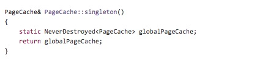
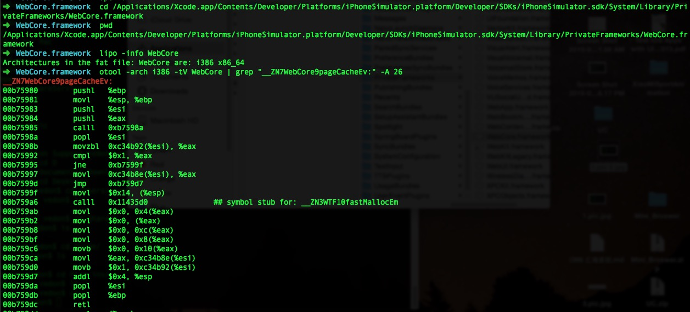

##汇编调用栈解析

以下截图来源于[WebCore/PageCache](https://github.com/WebKit/webkit/blob/d055853e59dd6cc4cfd835b143e79258bb13c552/Source/WebCore/history/PageCache.cpp)




使用otool 命令查看 WebCore.framework下对应函数的汇编代码：




%eax 是存函数的返回内容，％esi 是存函数的返回地址。(在ARM 架构下，r0 寄存器存返回的内容，r14 存返回的地址)所以由
```
00b75985	calll	0xb7598a
00b7598a	popl	%esi
```
可以得出： 
esi 的值是 0xb7598a

进而可以推出函数的返回值了，即eax的值。怎么知道？？？看这里

```
00b759ca	movl	%eax, 0xc34b8e(%esi)
```
eax 的值存在，esi 的0xc34b8e 处。


```
calll 0xb7598a  相当于： pushl %eip   再调用jmp 0xb7598a
							
retl 相当于： popl %eip
```

[更多调用栈相关知识1](http://www.cs.princeton.edu/courses/archive/spring11/cos217/lectures/15AssemblyFunctions.pdf)

[更多调用栈相关知识2](http://jixiuf.github.io/c/c_assemble.html)


